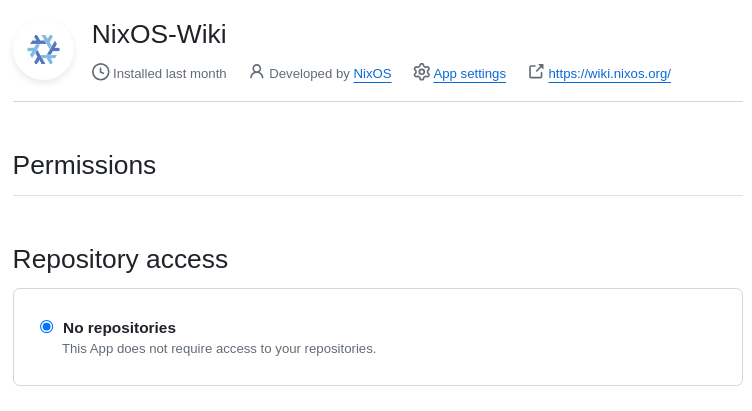

# nixos-wiki-infra

This project contains the setup of https://wiki.nixos.org

## Examples

Checkout [./targets/nixos-wiki.nixos.org]() for an example terraform deployment on hetzner cloud.

## Downloading a dump of the wiki

This is useful if you want to run your own instance.
Every day an xml dump is updated here:

https://wiki.nixos.org/wikidump.xml.zst

## Restoring from a backup (wiki admins only)

```
$ systemctl stop phpfpm-mediawiki.service
$ borg-job-wiki list
$ borg-job-wiki mount u391032-sub1@u391032.your-storagebox.de:wiki.nixos.org/repo::wiki-wiki-2024-04-01T12:40:37 /tmp/restore
$ ls -la /tmp/restore/var/lib/mediawiki/backup/
$ sudo dropdb db
$ sudo -u postgres dropdb mediawiki
$ systemctl restart postgresql.service
$ sudo -u postgres pg_restore -d mediawiki < /tmp/restore/var/lib/mediawiki/backup/db
$ systemctl start phpfpm-mediawiki.service
$ ls -la /tmp/restore/var/lib/mediawiki-uploads/
$ umount /tmp/restore/
```

## FAQ:

### When logging in with "Github auth", the app shows "Act on your behalf" as a permission.

We created the Oauth app with read-only access and minimal permissions:



Unfortunally GitHub mis-represents this information.
Read more about this issue here: https://github.com/orgs/community/discussions/37117

## Join our Matrix

https://matrix.to/#/#wiki:nixos.org


## Roles

Various roles are present on the wiki:
* Bureaucrats can assign roles to others. ([members](https://wiki.nixos.org/w/index.php?title=Special:ListUsers&group=bureaucrat), [permissions](https://wiki.nixos.org/wiki/Special:ListGroupRights#bureaucrat))
* Administrators can perform almost all restricted actions. ([members](https://wiki.nixos.org/w/index.php?title=Special:ListUsers&group=sysop), [permissions](https://wiki.nixos.org/wiki/Special:ListGroupRights#sysop))
* Moderators can perform a limited subset of restricted actions. ([members](https://wiki.nixos.org/w/index.php?title=Special:ListUsers&group=moderator), [permissions](https://wiki.nixos.org/wiki/Special:ListGroupRights#moderator))
* Trusted users can perform page deletions. ([members](https://wiki.nixos.org/w/index.php?title=Special:ListUsers&group=trusted), [permissions](https://wiki.nixos.org/wiki/Special:ListGroupRights#trusted))
